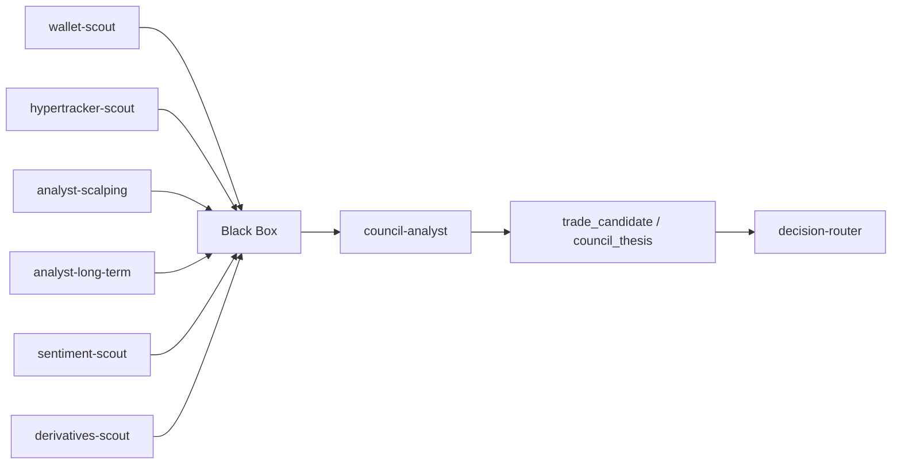

# Council Signal Tuning Design

## Goal
Make the crypto workspace produce stronger, more useful trade signals by improving the upstream analyst outputs that feed `council-analyst`.

## Current Problem
The workers are alive, but `council-analyst` still often returns `wait | confidence=0.0 | top coin=n/a`.

The likely cause is not a broken router. The problem is that the upstream analysts are not consistently producing strong enough rows for the council to score.

## Scope
This design focuses on the signal chain before council decision-making:

- `wallet-scout`
- `hypertracker-scout`
- `analyst-scalping`
- `analyst-long-term`
- `council-analyst`

It does not loosen council thresholds first. It improves the evidence that reaches the council.

## Design

### 1. Strengthen upstream analyst inputs
`analyst-scalping` and `analyst-long-term` should keep reading the same Black Box sources, but their outputs should be more clearly tied to:

- derivatives momentum
- wallet activity
- whale flow
- sentiment

The goal is for each analyst cycle to emit a real judgment, not just a low-confidence placeholder.

### 2. Preserve conservative council logic
`council-analyst` stays conservative for now.

It should still:

- favor the strongest coin setup
- favor wallet-driven signals when they are clearly stronger
- fall back to `watch` or `wait` when evidence is weak

This keeps the workspace safe while the upstream data quality improves.

### 3. Add a simple signal audit
Create a lightweight audit path that can answer:

- which worker wrote the latest row
- what type of opportunity it wrote
- whether the row had a real confidence/conviction value
- whether the council consumed it

This should make it easy to tell whether the system is weak because of missing data or because of the council rules.

## Data Flow

## Success Criteria

The design is working when:

- `analyst-scalping` emits non-empty `scalp` rows for at least some assets in the live window
- `analyst-long-term` emits non-empty `long_term` rows for at least some assets in the live window
- `council-analyst` starts producing meaningful `watch_*`, `follow_wallets`, or `enter_setup` decisions instead of mostly `wait`
- the decision router receives and publishes `trade_candidate` rows with actual content

## Non-Goals

- Do not loosen council thresholds first
- Do not add new paid APIs as the first fix
- Do not rewrite the whole workspace
- Do not replace the current worker architecture

## Implementation Order

1. Inspect the latest upstream analyst outputs.
2. Identify which inputs are missing or too weak.
3. Improve the weakest analyst path first.
4. Re-test whether council starts making clearer choices.
5. Only then consider threshold tuning if the workspace still feels too conservative.

